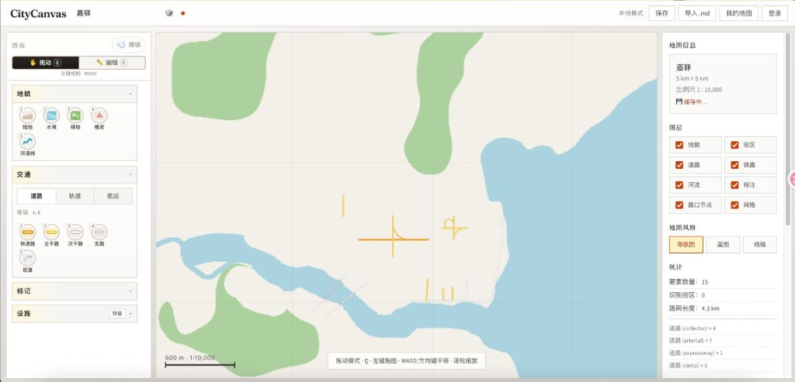
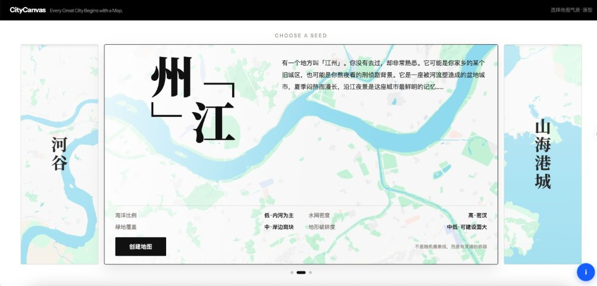
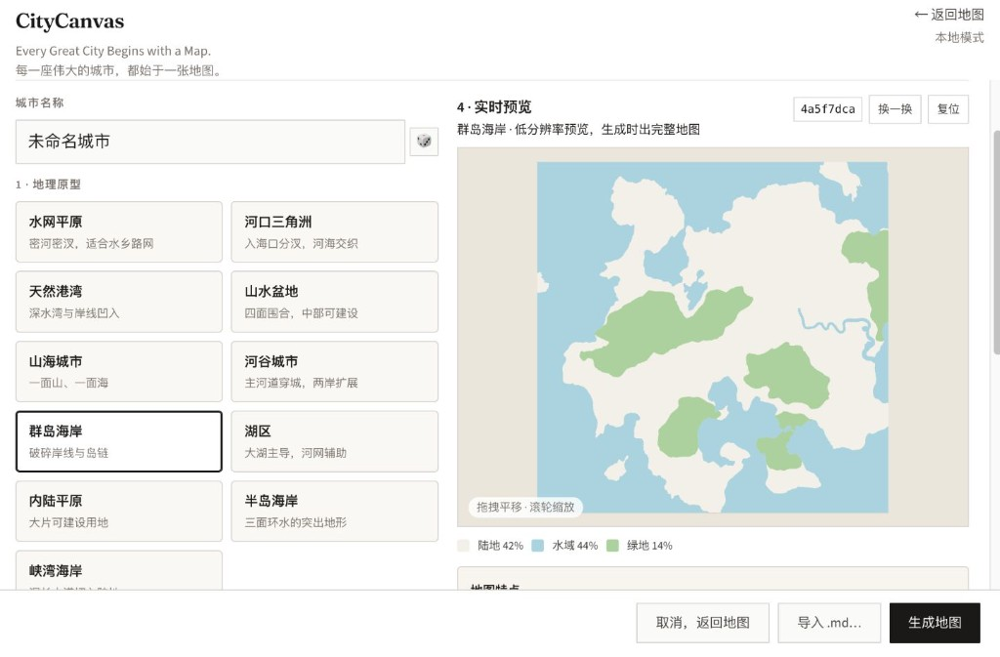
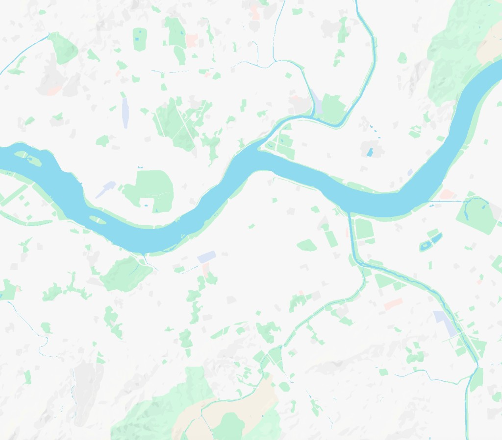
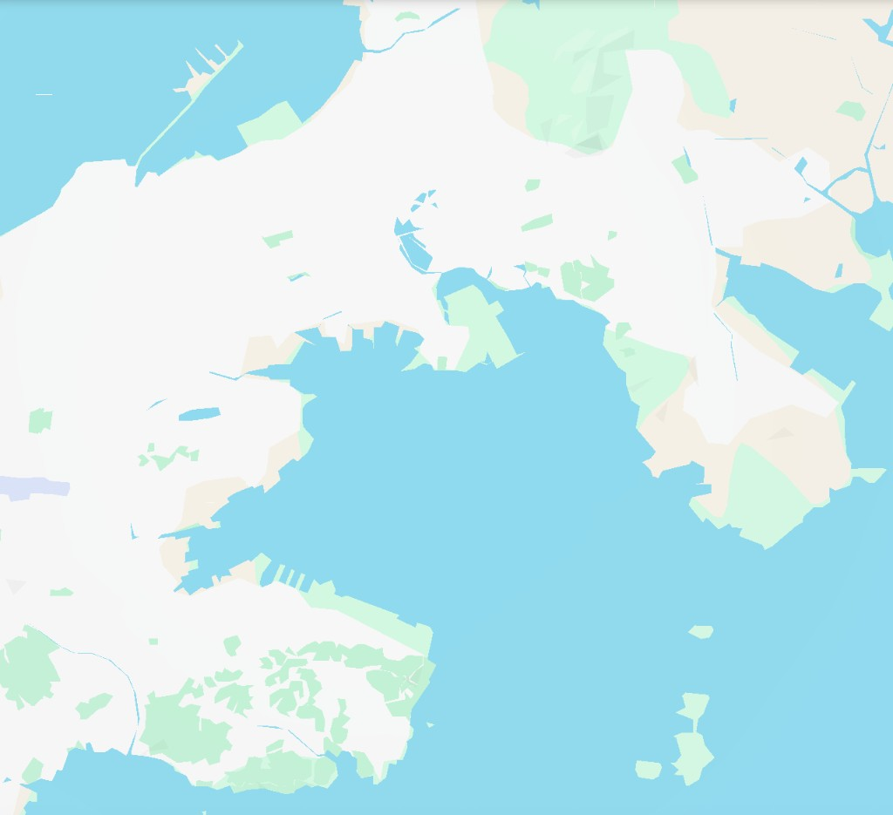
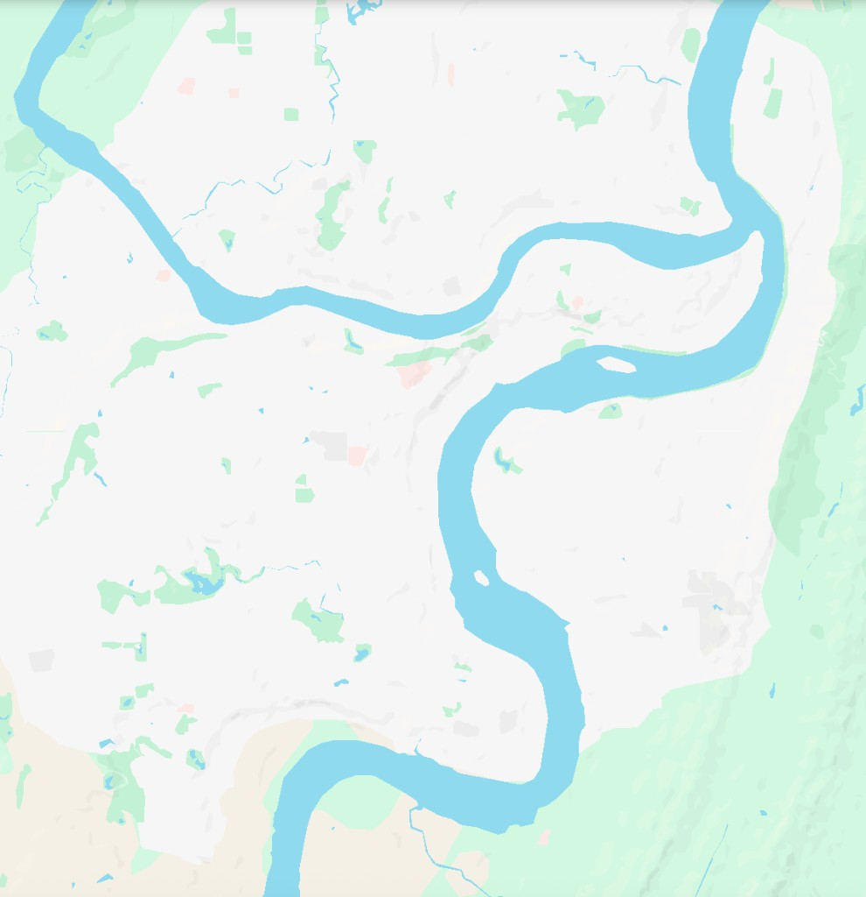
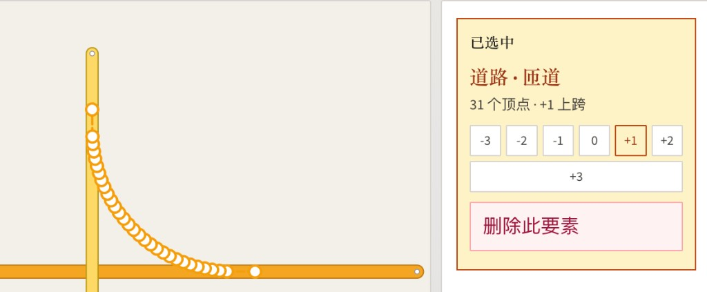

# CityCanvas

**架空城市地图绘制器** — 先用模式识别孕育地貌，再画路网与立交。

> **Every Great City Begins with a Map.**  
> **每一座伟大的城市，都始于一张地图。**

面向城市尺度的地貌与交通规划：不是 GIS，也不是模拟城市。  
适合架空底图、立交草图、结构推演与教学演示。



<p align="center"><sub>当前编辑器半成品 · 地貌刷子 + 五级道路 + 匝道立交</sub></p>

---

## 特色功能 · 地图生成器（模式识别）

地图生成器是 CityCanvas 的开局引擎：不靠一句 Prompt 瞎猜，而是用**可识别的地理原型 / Seed** 套结构化配方，再掷种子生成可编辑底图。

### 理想原型 · 选 Seed

选 Seed 不是抽随机数，而是选一座城市的**气质**：叙事文案 + 模式识别参数（海洋 / 水网 / 绿地 / 破碎度）一眼对齐。



<p align="center"><sub>理想原型（设计稿）：Choose a Seed · 江州 / 河谷 / 山海港城轮播</sub></p>

### 当前半成品 · 地理原型 + 预览

量产路径已落地：网格选地理原型 → 四参微调 → 低分实时预览 → 生成完整地图。UI 仍在迭代，目标对齐上方理想原型。



<p align="center"><sub>当前半成品：11 地理原型 + seed 换一换 + 陆水绿地占比预览</sub></p>

核心理念：

| 原则 | 含义 |
|------|------|
| **Player Creates, AI Accelerates** | 玩家创作，AI / 算法加速 |
| **真实感，不是真实还原** | 看起来像真实世界，不复制真实城市 |
| **采样 → 分类 → 提炼 → 验证** | 从真实地图格局提炼可复用的形态 DNA |

### 模式识别在做什么？

从真实城市截取固定尺度的自然格局（岸线、河湖、平原、丘陵），人工归类成风格库，再提炼成程序可读的 **Feature DNA**（地貌骨架 + 海岸偏向 + 水网形态 + 绿地分布 + 破碎度……）。  
生成时：选原型 → 套配方 → 调四个核心滑条 → 预览 → 落地为 `TerrainGenParams`。

| 你看到的 | 系统内部 |
|----------|----------|
| 「水网平原」卡片 | `channelStyle: dense_narrow` + 高水网密度 |
| 「河口三角洲」 | `landform: delta` + 分汊水道 + 接边海 |
| 「天然港湾」 | 深湾凹岸 + 陆海交错 |
| 「河谷城市」 | 主河穿城 + 两岸可建带 |

设计文档：[地图生成器共识 V1](docs/map-generator-consensus-v1.md) · [实现笔记](docs/map-generator-design.md)

### 肌理样例（模式库示意）

下面三张是**模式识别参考肌理**（自然层：水 / 绿 / 陆）。正式生成结果会随种子变化。

| 江州 · 主河塑城 | 港湾 · 陆海交错 | 河谷 · 两山夹一江 |
|:---:|:---:|:---:|
|  |  |  |

### 四步开局

1. **地理原型 / Seed** — 可识别的地貌气质（见下表；理想态为轮播选 Seed）  
2. **城市尺度** — 社区 / 小城市 / 城市 / 大都市 / 自定义  
3. **四核心参数** — 海洋比例 · 水网密度 · 绿地覆盖 · 地形破碎度  
4. **实时预览 → 生成地图** — 低分预览即时刷新；确认后再出完整底图  

### 11 个地理原型

| 原型 | 形态要点 | 现实参考（气质，非复制） |
|------|----------|--------------------------|
| 水网平原 | 密河密汊 | 苏州、嘉兴、湖州 |
| 河口三角洲 | 入海分汊、河海交织 | 珠江口、长江口 |
| 天然港湾 | 深水湾、岸线凹入 | 大连、青岛、厦门外侧 |
| 山水盆地 | 四面围合、中部可建 | 福州、武汉江段气质 |
| 山海城市 | 一面山、一面海 | 山海港城 |
| 河谷城市 | 主河穿城、两岸扩展 | 兰州谷、高原河谷 |
| 群岛海岸 | 破碎岸线与岛链 | 舟山、濑户内海气质 |
| 湖区 | 大湖主导 | 阳澄 / 鉴湖类格局 |
| 内陆平原 | 大片可建设 | 成都平原腹地气质 |
| 半岛海岸 | 三面环水 | 岬角型海岸 |
| 峡湾海岸 | 深长水道切入 | 峡湾型岸线 |

> **暂缓**：江南水乡 / 大湾区等命名 `StylePreset` 另议；当前以地理原型 + Feature DNA 为准。参考库自动提取为后续阶段。

---

## 产品定位

| 你在做什么 | CityCanvas 怎么帮你 |
|-----------|-------------------|
| 先定山、水、城的空间关系 | **地图生成器**（模式识别）+ 刷子微调 |
| 再铺快速路 / 主干 / 次干网 | 五级道路 + 平行线 + 弯道 |
| 需要立交、上跨、下穿 | **标高**分层：同层成路口，异层压盖 |
| 匝道连接异层 / 异级 | **匝道**工具：端点挂接、可分段拉通 |
| 路跨河 | 自动识别穿水段 → 桥 / 隧标记 |
| 存档与分享 | 本地缓存、可选云端、导出 PNG / SVG / `.md` |

核心机制一句话：

> **同层相交 = 路口；异层相交 = 上跨压盖；匝道用连续标高连接两层，中段相交不织平面路口。**

<!-- 后续实机特写


-->
> 📷 **截图位** `feature-grade.png` / `feature-ramp.png` — 立交与匝道特写（场景选定后补）

---

## 快速开始

```bash
npm install
cp .env.example .env   # 需要登录/云端时再配
npm run dev
```

| 服务 | 地址 |
|------|------|
| 前端 | http://localhost:5173 |
| API | http://localhost:3000（Vite 代理 `/api`） |

也可纯本地模式继续画图（不登录）。

---

## 用户手册

### 1. 界面与基础操作

| 操作 | 说明 |
|------|------|
| **拖图 · Q** | 左键拖图；滚轮缩放；WASD / 方向键平移；绘制中按住**空格**也可临时拖图 |
| **编辑 · E** | 选中要素、拖顶点、改标高；`Delete` 删除选中 |
| **撤销 · Ctrl/⌘ Z** | 撤销上一步编辑 |
| 侧栏「已选中」 | 类型、顶点数、标高芯片 |
| 图层开关 | 地貌 / 街区 / 道路 / 铁路 / 河流 / 标注 / 路口节点 / 网格 |
| 地图风格 | **导航图** / **蓝图** / **线稿** |

**路径绘制通用键**

| 键 | 作用 |
|----|------|
| 双击 / `Enter` | 完成当前折线 |
| `Backspace` | 回退上一顶点 |
| `Escape` | 取消本笔草稿 |
| 右键 | 打断本笔 |
| `Shift` | 直线模式：关闭软吸正交 |
| `Alt` | 关闭路网吸附 |

---

### 2. 新建地图（生成器）

进入编辑前走四步：地理原型 → 城市尺度 → 四参微调 → 预览生成。  
也可跳过生成、空白开局，或 **导入本地 `.md`** / 打开云端地图。

地图范围创建后固定。编辑页不能整图按种子重生，之后用刷子微调。

---

### 3. 地貌（刷子）

| 快捷键 | 工具 | 作用 |
|--------|------|------|
| `1` | 陆地 | 刷回陆地 |
| `2` | 水域 | 刷出湖泊/海面（栅格） |
| `3` | 绿地 | 刷出山地/绿地色块 |
| `4` | 橡皮 | 一次只擦一类 |
| `5` | 河道 | 画河道中心线 |

---

### 4. 道路等级（1–5）

| 键 | 等级 | 视觉 |
|----|------|------|
| `1` | 快速路 | 橙，最宽 |
| `2` | 主干路 | 黄 |
| `3` | 次干路 | 白 |
| `4` | 支路 | 浅灰 |
| `5` | **匝道** | 细线；配色随挂接端等级 |

同层同级相交插入路口；延伸到已有端点可首尾合并。

**直线 / 弯道 / 平行**：路径模式支持软吸正交、切线劣弧；道路可开平行线（双侧/单侧、间距可调）。

---

### 5. 标高（立交的核心）

标高 **-3 … +3**，默认 **0 地面**。

| 场景 | 行为 |
|------|------|
| 同层两条路相交 | 织成平面路口 |
| 异层相交 | 高层整层压在低层上，不织路口 |
| 选中改标高 | 侧栏或 `-` / `=`；平行姐妹线一起改 |

**建议**：先画下层 `0`，再调到 `+1`/`+2` 画上层跨过。

街区由同层道路围合自动识别，不单独存档。

---

### 6. 匝道

连接不同标高或不同道路等级；线宽固定偏细。

| 挂接 | 颜色 |
|------|------|
| 两端都没接到主路 | 灰（默认匝道色） |
| 只接一端，或两端同级 | 该级纯色 |
| 两端不同等级 | 沿路径渐变 |

匝道中段相交**不织平面路口**，按插值标高压盖；端点相接则合并并重算配色。

---

### 7. 桥与隧 · 铁路 · 标注

- **过河**（仅道路）：穿水域或靠近河道线 → 标高 ≥ 0 为桥（实线），&lt; 0 为隧（虚线）  
- **铁路**：普速 / 高铁 / 地铁（可自定义色）/ 有轨；直线弯道与标高同道路  
- **标注**：点选写文字  

---

### 8. 存档与导出

| 方式 | 说明 |
|------|------|
| 浏览器本地 | 自动缓存，刷新可续画 |
| 云端（登录后） | 账号存档，需后端 |
| 导出 | PNG / SVG / `.md` |

---

## 开发与部署

**技术栈**：Vite + React + TypeScript（Canvas）；可选 Hono + SQLite + JWT。

| 变量 | 说明 |
|------|------|
| `JWT_SECRET` | JWT 签名（云端必填） |
| `DATABASE_PATH` | SQLite 路径，默认 `/data/citycanvas.db` |

```bash
docker build -t citycanvas .
docker run -p 3000:3000 -v citycanvas-data:/data \
  -e JWT_SECRET=你的随机密钥 \
  -e NODE_ENV=production \
  citycanvas
```

- **Zeabur**：Docker + Volume → `/data` + `JWT_SECRET`  
- **Vercel**：静态前端；账号/云端存档需带持久化卷的 Docker，勿当云端版  

截图清单与命名约定见 [`docs/readme-media/README.md`](docs/readme-media/README.md)。

---

## 常见问题

**Q：异层交叉还是并成一块？**  
确认两条路标高不同。硬刷新后再看高层边线是否压过下层。

**Q：匝道一段灰一段黄？**  
未接主路为灰；接到后按首尾等级上色。端点对齐会合并并重算。

**Q：生成器换原型后地貌差很多？**  
正常：原型换的是 Feature DNA 骨架，不是同一张图微调。四滑条只在配方上扰动。

**Q：换电脑后图没了？**  
本地缓存在当前浏览器。请导出 `.md` 或使用云端存档。

---

## License

MIT
